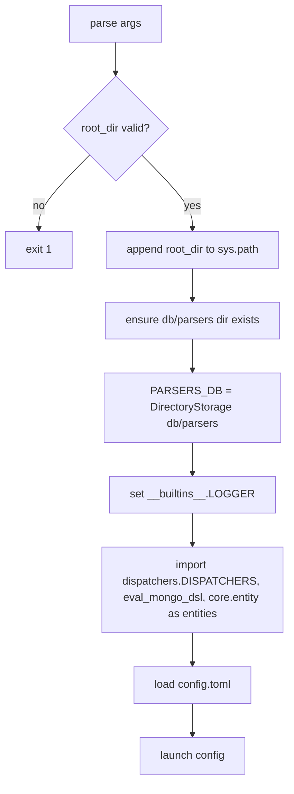
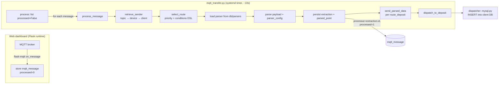

# `services/mqtt_transfer` — The background ingest→parse→route→dispatch worker

> The **second runtime** of MqttRelay (see `AGENTS.md` §2). This directory contains the
> standalone background job that takes the raw MQTT messages persisted by the web dashboard,
> normalises them into time-series points, and pushes those points to each client's own
> destination sink. It runs **outside** Flask, on a `systemd` timer, every ~10 seconds.

```
MQTT broker ──► Flask-MQTT ──► mqtt_message (raw, processed = 0)
                                       │
              systemd timer fires every 10s
                                       ▼
              ┌────────────────────────────────────────────────┐
              │  mqtt_transfer.py (this service, standalone)   │
              │  1. job guard:  job.state == RUNNING ? abort   │
              │  2. retrieve_sender: topic → device → client   │
              │  3. select_route:  routing_rule (priority+DSL) │
              │  4. parse:  db/parsers/<name>_<version>.py     │
              │  5. persist: extraction + parsed_point          │
              │  6. dispatch: route_deposit → dispatcher        │
              └────────────────────────────────────────────────┘
                                       ▼
                            client's own MySQL database
```

---

## Table of contents

- [Role in the pipeline](#role-in-the-pipeline)
- [Directory contents](#directory-contents)
- [How it boots (entrypoint & args)](#how-it-boots-entrypoint--args)
- [The job guard (concurrency lock)](#the-job-guard-concurrency-lock)
- [Architecture & data flow](#architecture--data-flow)
- [Core pipeline, step by step](#core-pipeline-step-by-step)
- [Parser contract](#parser-contract)
- [Routing rules & condition DSL](#routing-rules--condition-dsl)
- [Dispatchers](#dispatchers)
- [Data model (tables it touches)](#data-model-tables-it-touches)
- [Configuration](#configuration)
- [Deployment (systemd)](#deployment-systemd)
- [Running manually / debugging](#running-manually--debugging)
- [Logging](#logging)
- [Exit codes](#exit-codes)
- [Known issues & rough edges](#known-issues--rough-edges)

---

## Role in the pipeline

The web dashboard only **ingests** MQTT messages: `blueprints/mqtt.py::handle_mqtt_message`
stores every raw payload into the `mqtt_message` table with `processed = 0`. All of the actual
**processing** happens here, in a separate process:

1. **Retrieve sender** — resolve the message's topic to its owning `device` and `client`.
2. **Select route** — pick the best `routing_rule` (priority + optional conditions DSL).
3. **Parse** — run the rule's versioned parser against the raw payload.
4. **Normalise** — write one `extraction` row + N `parsed_point` rows (typed values).
5. **Dispatch** — push the points to every `client_destination` linked to the rule via
   `route_deposit`, through a pluggable **dispatcher**.

The job is **idempotent by design** at the top level: it only touches messages with
`processed = false`, and marks them processed when done.

---

## Directory contents

| File | Purpose |
| --- | --- |
| `mqtt_transfer.py` | The worker itself — CLI entrypoint, `MqttTransfer` engine class, job guard helpers. |
| `dispatchers/__init__.py` | Dispatcher registry: `DISPATCHERS = {"mysql": MysqlDispatcher}`. **Add new sink types here.** |
| `dispatchers/mysql.py` | The MySQL dispatcher — inserts `parsed_point`s into a client's own database. |
| `mqtt_transfer.service` | `systemd` **service** unit (Type=oneshot), starts right after MySQL. |
| `mqtt_transfer.timer` | `systemd` **timer** unit — fires the service every 10 seconds. |
| `mqtt_transfer.sh` | Bash launcher wrapper (parses `-v` venv / `-l` logging args, then runs the Python entrypoint). |

The only file you normally edit is `mqtt_transfer.py` (engine + pipeline). New sinks are added by
writing a new `dispatchers/<type>.py` and registering it in `dispatchers/__init__.py`.

---

## How it boots (entrypoint & args)

`mqtt_transfer.py` is a **standalone script** — it never touches `run.py` / `build_app()`.

```bash
python services/mqtt_transfer/mqtt_transfer.py --root-dir . --logging-dir logs
```

| Arg | Short | Meaning |
| --- | --- | --- |
| `--root-dir` | `-r` | MqttRelay root; must be a valid directory, is prepended to `sys.path`. |
| `--logging-dir` | `-l` | Where to write `MqttTransfer.log` (rotating). `None` ⇒ console only. |

Boot sequence (bottom of `mqtt_transfer.py`):



**Important runtime-context detail** (from `AGENTS.md` §2): in this process entities are accessed
**module-qualified** — `entities.MqttMessage`, `entities.Parser`, … — never as bare globals the
way blueprints do. The module imports `import core.entity as entities`. The `LOGGER` global is
also injected as a **builtin** (`setattr(__builtins__, 'LOGGER', …)`) so the engine can use it
without importing anything.

---

## The job guard (concurrency lock)

Because the timer fires every 10 seconds but a run may last longer than that, the worker uses the
`job` table as a mutex:

| Helper | Effect |
| --- | --- |
| `already_running(**creds)` | Loads `job` row `name='MqttTransfer'`; returns `True` if `state == "RUNNING"`. |
| `start_run(**creds)` | Sets `state = 'RUNNING'` on that row. |
| `stop_run(exit_code, **creds)` | Sets `state = 'IDLE'` + `last_exit_code`; **`sys.exit(exit_code)`** if non-zero. |

`launch(config)`:

1. `already_running()` → if so, log *"Mqtt Transfer job is already ongoing. Postponing
   execution."* and return (the timer will simply fire again later).
2. `start_run()` — mark RUNNING.
3. Build `MqttTransfer(**config["storage"]["credentials"])` and run `process()`.
4. Return exit code: `0` = all good, `2` = some messages failed.

The `main` block wraps `launch()` in `try/except`: on a crash it logs the traceback and calls
`stop_run(1, …)` so the lock is released; otherwise it calls `stop_run(exit_code, …)`.

> The `job` row with `name = 'MqttTransfer'` must exist (the installer creates it) — 
> `already_running()` dereferences the lookup result directly.

---

## Architecture & data flow



### The engine: `MqttTransfer` class

Instantiated once per run with the MySQL credentials from `config.toml`. In `__init__` it builds a
`MysqlEntityStorage` for each entity involved:

| Key | Entity | Table |
| --- | --- | --- |
| `mqtt_messages` | `MqttMessage` | `mqtt_message` |
| `parsers` | `Parser` | `parser` |
| `metrics` | `Metric` | `metric_catalog` |
| `parsed_points` | `ParsedPoint` | `parsed_point` |
| `extractions` | `Extraction` | `extraction` |
| `clients` | `Client` | `client` |
| `device_types` | `DeviceType` | `device_type` |
| `topics` | `MqttTopic` | `mqtt_topic` |
| `devices` | `Device` | `device` |
| `routes` | `RoutingRule` | `routing_rule` |
| `deposits` | `RouteDeposit` | `route_deposit` |
| `dispatches` | `Dispatch` | `dispatch` |
| `destinations` | `ClientDestination` | `client_destination` |

It also keeps two **in-memory caches** to avoid hammering the DB:

- `metrics_cache` — `metric_catalog` rows by id (used by `_load_metric`).
- `device_types_cache` — device-type rows by id (used by `_load_device_type`).

---

## Core pipeline, step by step

### Step 1 — `retrieve_sender(message)` → (topic, device, client)

Resolves who sent the message, in order:

1. `topics.get(topic=message['topic'], active=True)` → if missing, retry without the `active`
   filter; if still missing raise `TopicNotFound`; if found but **disabled** raise `DisabledTopic`.
2. `devices.get(id=topic['device_id'])` → else `DeviceNotFound`.
3. `clients.get(id=topic['client_id'])` → else `ClientNotFound`.

### Step 2 — `select_route(client, device, topic, message)` → routing_rule

1. Loads all **active** rules for this `(client_id, topic_id)` that also match the device:
   `Or(Equals(device_id=device.id), Equals(device_id=<unset>))` — i.e. rules may target one
   specific device **or** no device in particular (wildcard).
2. For each candidate, if `conditions` is non-empty JSON, evaluate
   `eval_mongo_dsl(conditions, ctx)` where `ctx = {device, device_type, topic, message}`.
   - conditions **passed** ⇒ candidate gets `evaluated[id] = 1`;
   - conditions **failed** (returned False) ⇒ candidate is skipped;
   - conditions **threw** ⇒ the rule is treated as *conditionless* and penalised with
     `evaluated[id] = -1` (its effective priority is raised, making it less likely to win).
3. **Selection** = lowest raw `priority` (lower wins); then, among those, the lowest
   `priority - evaluated` (so a rule whose conditions actually matched outranks a conditionless
   rule of equal priority); ties broken by **newest** `created_at` (a warning is logged if several
   rules tie).
4. No candidate ⇒ `NoRouteFound`. Finally, validates `parser_config` is valid JSON.

### Step 3 — `load_parse_function(parser)` → `parse`

- Only `language == "python"` is supported; anything else raises `LanguageNotHandled`.
- The module file is derived from the parser identity:
  `db/parsers/<name(lower, spaces→_)>_<version(dots→_)>.py` (e.g. `lse01_parser_1_0_0.py`)
  and loaded with `importlib.import_module("db.parsers.<filename>")`.
- Missing file ⇒ `ParserCodeNotFound`.

### Step 4 — `process_message(message)` → (parsed_points, extraction, route)

Builds an `extraction` (new uuid, `message_id`, `parsed_at=now`, `success=True`), then:

1. resolves sender & route (steps 1–2);
2. `parse_function(payload, **json.loads(parser_config))` — payload is JSON-decoded if it is a
   string;
3. if the parser returned **nothing**, `extraction.success = False` and an error is recorded
   (`extracted_count` left unset);
4. otherwise `extracted_count = len(results)`;
5. timestamp `ts = message['at']`, overridden by a top-level `"at"` key in the parser output;
6. each **integer** key of the output is treated as a `metric_catalog` id → a `ParsedPoint`:
   - value type decides the value column: `int`/`float` → `num_value`, `str` → `str_value`,
     `bool` → `bool_value`, `dict`/`list` → `json_value` (JSON-serialised);
   - `unit` is taken from the metric's `default_unit`;
   - `quality` comes from `judge_data_quality(...)` (currently a **stub** that always returns
     `"good"`);
   - all **non-integer** keys of the parser output are bundled into `meta_json` (this is how a
     parser can attach extra context — see the dispatcher's id-remapping below);
   - unknown metric ids raise `MetricNotFound`.

### Step 5 — `process()` — the outer loop

1. `mqtt_messages.list(processed=False)` → all pending messages.
2. For each: run `process_message`, persist the `extraction`, then every `parsed_point`.
3. If the extraction failed ⇒ record `False`, **skip** (the message stays unprocessed → retried
   next run).
4. Otherwise `send_parsed_data(route, extraction, points)`:
   - load all `route_deposit` rows for the rule (⇒ `DepositNotFound` if none);
   - for each deposit → `dispatch_to_deposit` (Step 6);
   - overall result = AND of all dispatches.
5. Update the message: `processor = extraction.id` and, **only if every dispatch succeeded**,
   `processed = True`. A message whose dispatch failed stays unprocessed and is reprocessed on a
   later run.

### Step 6 — `dispatch_to_deposit(deposit, extraction, data_points)`

1. Load `client_destination` by `deposit['destination_id']` (⇒ `DestinationNotFound`).
2. Create a `Dispatch` row (`status="queued"`, `attempts=1`).
3. Look up the dispatcher class: `DISPATCHERS[destination.type.name.lower()]`
   (⇒ `DispatcherNotFound` if unimplemented).
4. Instantiate it with the destination row's fields **plus** `options_json` (merged as kwargs).
5. If the dispatcher declares `asynchronous = True`, register a completion callback.
6. Call `dispatcher.dispatch(parsed_points=[p.to_dict() for p in points])`.
   - Any exception is caught and turned into `{"status":"failed", "response_snippet": traceback}`.
7. For synchronous dispatchers, reflect the result onto the `Dispatch` row via `on_data_sent`.
   `on_data_sent` snapshots the row, applies `status/http_status/response_snippet` and returns
   `status == "sent"`.

---

## Parser contract

A parser = one `parser` row + one source file in `db/parsers/`.

- **Filename**: `<name lower, spaces→_>_<version, dots→_>.py` — e.g. `lse01_parser_1_0_0.py`.
  The dashboard writes **two** files (a `DirectoryStorage` source file and the importable `.py`),
  see `blueprints/parsers.py::editParser`.
- **Module must export** `def parse(data, **config)`.
- **Return value** is a dict:
  - **integer keys** = `metric_catalog` ids → typed point values;
  - optional **`"at"`** key overrides the message timestamp;
  - **non-integer keys** land in `meta_json` (extra context, remapping tables, etc.).

Example (the bundled LSE01 parser):

```python
def parse(data, **config):
  config.update({
    1: data.get("Temp_SOIL"),      # metric_catalog id 1
    2: data.get("Water_SOIL"),     # metric_catalog id 2
    3: data.get("Conduct_SOIL")    # metric_catalog id 3
  })
  return config
```

> `Parser.FILE_EXTENSIONS` already maps `python→py`, `javascript→js`, `bash→sh`, but the worker
> only implements the **python** loader (`load_parse_python_function`). Adding another language
> means implementing its loader here **and** registering its extension there.

---

## Routing rules & condition DSL

Routing is driven by `routing_rule` rows:

- Each rule binds a `client` to a `parser` (optionally a specific `topic` / `device`) and holds a
  `parser_config` (JSON passed to the parser) plus a `priority` (lower wins) and optional
  `conditions` (JSON).
- Destinations are attached via `route_deposit(rule_id, destination_id)`.

`conditions` are evaluated by `tools/json_conditions.py::eval_mongo_dsl(rule, ctx)` with
`ctx = {device, device_type, topic, message}`. Supported operators:

`$eq $ne $gt $gte $lt $lte $in $nin $exists $regex $contains $startswith $endswith $between
$elemMatch`, plus `$and / $or / $not` and shorthand equality (`{"field": 123}`). Dotted paths are
supported (e.g. `payload.Temp_SOIL`), ISO-8601 strings are promoted to datetimes for comparison.

```json
{ "$and": [
    { "device_type.model": "LSE01" },
    { "message.qos": { "$gte": 0 } },
    { "payload.Temp_SOIL": { "$between": [0, 60] } }
] }
```

### How `parser_config` affects the output

`parser_config` is the **per-route, runtime configuration injected into the parser** — it does
not touch the transport directly, but it shapes the points that eventually reach the destination.
It is a JSON string stored on `routing_rule` (set when creating/editing a rule) and snapshotted
onto `extraction.parser_config` as an audit trail of what configuration produced a run.
`select_route` only validates that it parses as JSON (`json.loads(selected['parser_config'] or
"{}")`, raising `ValueError` otherwise), and `process_message` then calls
`parse_function(payload, **json.loads(route['parser_config'] or "{}"))` — i.e. the parsed config
is unpacked into keyword arguments handed to the parser's `parse(data, **config)`. The parser can
read those values to change its behaviour (field names to extract, thresholds, calibration
constants, or even which `metric_catalog` ids to emit), so the same parser version can behave
differently per client/topic depending on the rule's config.

The config only influences the **parser's return value**, and that return value drives the
outgoing data: integer keys become `metric_catalog` ids → the typed
`num_value`/`str_value`/`bool_value`/`json_value` columns on each `ParsedPoint`; a top-level
`"at"` key overrides the timestamp; every non-integer key is bundled into each point's
`meta_json`. Since the MySQL dispatcher reads `meta_json.devices` and `meta_json.metrics` to remap
`device_id`/`metric_id` on the way in, a `parser_config` that makes the parser emit such a
translation table will indirectly change the exact rows written into the client's database.
Delivery mechanics (table, columns, conflict handling) remain governed entirely by the
destination's own `options_json`, not by `parser_config`.

---

## Dispatchers

### Registry (`dispatchers/__init__.py`)

```python
from .mysql import MysqlDispatcher
DISPATCHERS = {"mysql": MysqlDispatcher}
```

Key = lowercase `client_destination.type` enum value (`mysql`, `postgres`, `http`, `kafka`,
`file`, `other`). Only `mysql` is implemented today.

### Dispatcher contract

A dispatcher is a class instantiated with the destination's column values **plus** the parsed
`options_json` as kwargs. It must implement:

```python
def dispatch(self, parsed_points: list[dict]) -> dict:
    # returns {"status": "sent"|"failed", "http_status": int|None, "response_snippet": str}
```

Optionally it can declare `asynchronous = True` and expose `setCallback(cb)`; the engine will
then call `cb(**result)` when the async work completes and treat the dispatch as successful
without waiting.

### `MysqlDispatcher` (`dispatchers/mysql.py`)

Inserts `parsed_point`s into the client's **own** MySQL database. Expected destination keys:
`host`, `port`, `database_name`, `username`, plus `password` **or** `password_enc`
(encrypted secret, base64-decoded by `_decode_secret` — replace with your KMS/vault decrypt as
needed). `options_json` supports:

| Option | Default | Meaning |
| --- | --- | --- |
| `table` | `parsed_points` | Target table name. |
| `column_map` | 1:1 canonical map | `{source_key → dest_column}` (see note below). |
| `conflict_keys` | `["device_id","key_name","ts"]` | Source keys forming the target UNIQUE key. |
| `on_conflict` | `update` | `ignore` \| `update` \| `error`. |
| `batch_size` | `1000` | Rows per `executemany` + commit. |

Behaviour highlights:

- Builds `INSERT [IGNORE] INTO ... VALUES (...)` with an optional
  `ON DUPLICATE KEY UPDATE` clause over the non-conflict columns.
- `_row_from_point` maps each point: the virtual `value` key resolves to whichever
  `*_value` column is non-null (errors if zero or several); `device_id` / `metric_id` can be
  **remapped through `meta_json.devices` / `meta_json.metrics`** (a parser can ship id-translation
  tables); JSON-ish values are serialised; ISO timestamps are converted to MySQL `datetime`.
- Batches are inserted with `executemany` and committed per batch (`autocommit=False`).
- Returns a human-readable `response_snippet` with approximate `inserted/updated/ignored` counts
  (rowcount heuristics).

### MySQL destination table (reception contract)

The dispatcher writes into the **client's own** MySQL database — a separate database from the
platform's. With the default `column_map` / `conflict_keys`, the target table (default name
`parsed_points`) must look like this:

```sql
CREATE TABLE parsed_points (
    device_id  BIGINT          NOT NULL,
    key_name   VARCHAR(128),             -- ⚠️ see caveat below
    ts         DATETIME(6)     NOT NULL, -- UTC
    value      TEXT,                     -- ⚠️ polymorphic column, see caveat below
    unit       VARCHAR(32),
    quality    VARCHAR(16),              -- 'good' | 'suspect' | 'bad'
    meta_json  JSON,
    UNIQUE KEY uq_pt (device_id, key_name, ts)  -- required for on_conflict=update
) ENGINE=InnoDB DEFAULT CHARSET=utf8mb4;
```

Two caveats when relying on the defaults:

- **`value` is polymorphic** — the platform's source points carry up to four typed columns
  (`num_value`, `str_value`, `bool_value`, `json_value`). The default `column_map` collapses them
  into a single destination `value` column (the virtual key picks the one non-null `*_value`), so
  that column must accept numbers, strings, booleans **and** JSON. To keep the typed columns
  separate instead, override `column_map`:

  ```json
  {
    "column_map": {
      "device_id": "device_id", "metric_id": "key_name", "ts": "ts",
      "num_value": "num_value", "str_value": "str_value",
      "bool_value": "bool_value", "json_value": "json_value",
      "unit": "unit", "quality": "quality", "meta_json": "meta_json"
    },
    "conflict_keys": ["device_id", "key_name", "ts"]
  }
  ```

  (this mirrors the platform's own `parsed_point` table in `install/storages/dbscheme.sql` —
  again, that is a *different* database/table from the client destination).

- **`key_name` is a trap with the default mapping** — the worker's `ParsedPoint` stores the metric
  as **`metric_id`** (an int into the platform `metric_catalog`), not `key_name`. `_row_from_point`
  does `point.get("key_name")`, which is always `None` under the default map, so the destination
  `key_name` column would be written `NULL`. Map `metric_id` → your key column instead and set
  `conflict_keys` accordingly (e.g. `["device_id", "metric_id", "ts"]`). `metric_id` values can
  also be remapped through `meta_json.metrics` if the parser ships a translation table.

Other requirements:

- With `on_conflict=update` (default) the table **must** have a UNIQUE index on the conflict
  columns (`device_id, key_name, ts` by default), otherwise `ON DUPLICATE KEY UPDATE` never
  triggers and duplicates accumulate. `on_conflict=ignore` silently drops duplicates; `error`
  turns duplicates into failures.
- `ts` is the pipeline's UTC timestamp, written as a MySQL `DATETIME(6)`.
- The connection uses `host` / `port` / `database_name` / `username` plus `password` (or the
  encrypted `password_enc`, decoded by `_decode_secret` — replace with KMS/vault as needed).

---

## Data model (tables it touches)

See `install/storages/dbscheme.sql` for the canonical DDL (and `core/entity/*.py` for the Temod
definitions). This service reads/writes:

| Table | Read / Write | Notes |
| --- | --- | --- |
| `job` | RW | Concurrency lock (`MqttTransfer` row). |
| `mqtt_message` | R + W | Reads `processed=false`, writes `processor` + `processed`. |
| `mqtt_topic` | R | Resolve topic → device/client. |
| `device` / `device_type` | R | Sender identity + route context. |
| `client` | R | Sender's owning client. |
| `routing_rule` | R | Route selection. |
| `route_deposit` | R | Rule → destination links. |
| `parser` | R | Parser metadata (name/version/language). |
| `metric_catalog` | R | Value typing + default units. |
| `extraction` | W | One per processed message. |
| `parsed_point` | W | Normalised time-series points. |
| `dispatch` | W | Per destination dispatch ledger (`queued/sent/failed/...`). |
| `client_destination` | R | Destination connection + options. |

---

## Configuration

The worker reads `config.toml` at the `--root-dir`. The relevant section is the same one the
dashboard uses:

```toml
[storage.credentials]
host = "127.0.0.1"
port = 3306
database = "mqtt"
# username / password are supplied by the installer
```

These credentials are passed verbatim to every `MysqlEntityStorage`. The `[mqtt]` / `[app]` /
`[temod]` sections are **not** used by this service (it never connects to the broker itself —
the dashboard does).

---

## Deployment (systemd)

`mqtt_transfer.timer` fires every 10 seconds:

```ini
[Timer]
OnUnitActiveSec=10s
OnBootSec=10s
```

`mqtt_transfer.service` is `Type=oneshot`, `After=mysql.service`, and runs
`/bin/bash $script_path $logging_dir $venv_path`. `mqtt_transfer.sh` parses `-v <venv_path>` and
`-l <logging_dir>`, sources the venv, `cd`s to the repo root, then runs:

```bash
python "$SCRIPTPATH/mqtt_transfer.py" --root-dir "$MQTT_RELAY" --logging-dir "$logging_dir"
```

Enable & watch:

```bash
sudo systemctl enable --now mqtt_transfer.timer
journalctl -u mqtt_transfer -f
```

> ⚠️ The `mqtt_transfer.service` file passes **positional** args
> (`$script_path $logging_dir $venv_path`) while `mqtt_transfer.sh` expects **flags** (`-v`/`-l`).
> In a real install these variables are expected to come from the unit's `Environment=` (set by
> the installer); make sure the ordering matches, or the wrapper will reject the args. See
> [rough edges](#known-issues--rough-edges).

---

## Running manually / debugging

A one-shot run is the easiest way to debug (no waiting for the timer):

```bash
venv/bin/python services/mqtt_transfer/mqtt_transfer.py --root-dir . --logging-dir logs
```

Expected output pattern (INFO goes to the log file, WARNING+ also to the console):

```
<messages> mqtt messages unprocessed
<messages> sent by device #<id> of client <name> (#<id>)
route (#<id>) selected for message #<id>
<parser> selected for message #<id>
Dispatcher of type MysqlDispatcher has been loaded and initialized successfully
All new data treated successfully.     # exit 0
# or
Some data wasn't treated successfully. # exit 2
```

---

## Logging

`get_logger(logging_dir)` configures the root logger once:

- **File**: `<logging_dir>/MqttTransfer.log`, `RotatingFileHandler`, 5 MB × 3 backups, level
  `INFO`, UTF-8.
- **Console**: `StreamHandler(stdout)`, level `WARNING`.
- If `logging_dir` is missing/invalid it warns that no file logs will be kept.

---

## Exit codes

| Code | Meaning |
| --- | --- |
| `0` | All pending messages processed + dispatched successfully. |
| `2` | Some messages were processed but at least one failed to dispatch / parse. |
| `1` | Unhandled exception during `launch` (also written to `job.last_exit_code`). |

`job.state` is set back to `IDLE` and `last_exit_code` recorded on every exit path.

---

## Known issues & rough edges

### Bugs found & fixed

The following **bugs were found and fixed** in `mqtt_transfer.py` / `dispatchers/mysql.py`:

- `clients` storage was bound to `entities.Parser` instead of `entities.Client` — now correct.
- There was no `device_type` storage and `_load_device_type` read from the `metrics` storage —
  a `device_types` storage (`entities.DeviceType`) is now registered and used.
- `DisabledTopic`, `LanguageNotHandled` and `DestinationNotFound` were raised but never declared
  — they are now declared at the top of the module (previously a `NameError`).
- The asynchronous dispatch callback closed over `deposit` (`RouteDeposit`) instead of `dispatch`
  (`Dispatch`) — it now targets the correct `dispatch` row.
- `select_route` logged the last iterated `route` instead of the `selected` one — it now logs the
  winner.
- `process(directory)` accepted an unused `directory` argument — the parameter was removed.
- The empty-parser-result path wrote `extraction['error']` (a field that doesn't exist on
  `Extraction` → `MalformedEntityException`) and left the **required** `extracted_count` unset
  (→ `MissingRequiredAttributeError`). It now writes `error_text` and sets `extracted_count = 0`.
- `already_running`/`start_run`/`stop_run` crashed if the `job` row was missing — a new
  `_get_or_create_job()` helper creates it (with `state=IDLE`) instead.
- `get_logger(None)` crashed on `os.makedirs(None, ...)` (the `--logging-dir` default) — the
  `makedirs` call is now guarded.
- `select_route` **never actually evaluated conditions**: condition strings weren't JSON-parsed,
  and `eval_mongo_dsl(conditions, **context)` passed the context as kwargs instead of the `ctx`
  argument (raising `TypeError`), so every conditional route was skipped or penalised. It now
  parses JSON and calls `eval_mongo_dsl(conditions, context)`.
- `select_route`'s effective-priority filter was rewritten to precompute the effective minimum
  once (the inline `min([...])` inside the list-comprehension filter misbehaved in this context).
- `process_message` bundled the parser's `"at"` key into `meta_json`, crashing `json.dumps` on
  datetimes — `"at"` is now excluded from the metadata.
- `process()` error log called `json.dumps(mqtt_message.to_dict())`, crashing on the message's
  datetime `at` field and masking the real error — it now uses `default=str`.
- `MysqlDispatcher` docstring said `on_conflict` defaults to `"ignore"` and listed a `column_map`
  default that didn't match the code — both now match the code (`"update"`, `value`-based map).

### Testing (smoke tests)

The suite lives in `services/mqtt_transfer/tests/` and runs against in-memory `FakeStorage`
objects (no MySQL needed):

```bash
venv/bin/python -m pytest
```

Every function/class in `mqtt_transfer.py` is exercised: `load_configs`, `get_logger`, the
job-guard helpers (`_get_or_create_job` / `already_running` / `start_run` / `stop_run`),
`launch`, all exception classes, `MqttTransfer.__init__` and its helpers, parser loading,
`retrieve_sender`, `select_route`, `process_message`, `on_data_sent`, `dispatch_to_deposit`,
`send_parsed_data` and the outer `process()` loop.

### Remaining behaviour to be aware of (design trade-offs, not bugs)

- **Failed dispatches are retried from scratch** — a message whose dispatch fails is left
  `processed = false` and reprocessed on the next run, which re-runs the parser and can create
  duplicate `extraction`/`parsed_point` rows. There is no dedup guard at the pipeline level
  (mitigation is only at the sink via the dispatcher's `conflict_keys` / `on_conflict`).
- **`select_route` "any device" matching** relies on `Equals(attribute)` with no value being
  rendered as `IS NULL` (`(device_id = X) or (device_id is null)`). This requires a Temod version
  that supports it (current versions do); older Temod versions produced invalid SQL.
- **`select_route` condition context has no `payload` key** — the DSL supports `payload.*` paths,
  but the context built by `select_route` is only `{device, device_type, topic, message}`. A
  condition on `payload.*` resolves to `None` and fails the comparison; use `message.*` paths
  (the payload is available as `message.payload`) instead.
- **`mqtt_transfer.service` placeholders** (`$script_path $logging_dir $venv_path`) look positional
  in the template, but the installer (`install/setup.py::install_mqtttransfer_service`) substitutes
  them with `-v` / `-l` **flags**, which `mqtt_transfer.sh` parses — so there is no mismatch in
  practice.
- **`mqtt_transfer.service` vs `mqtt_transfer.sh` arg mismatch** — the unit passes positional args
  but the wrapper parses `-v`/`-l` flags; keep them consistent when installing.
